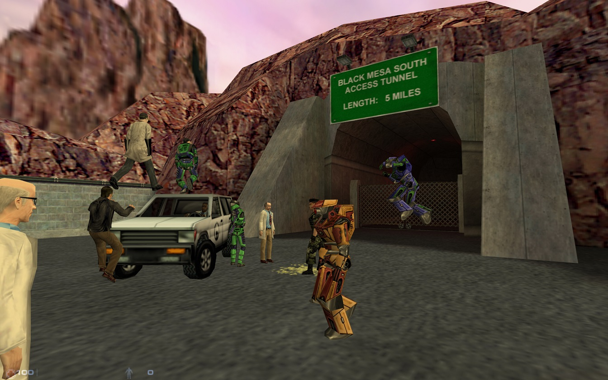
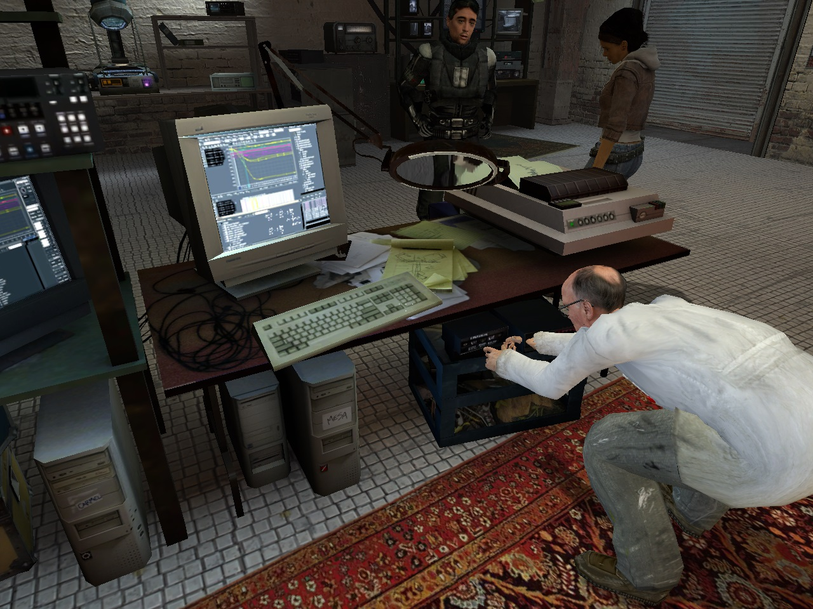
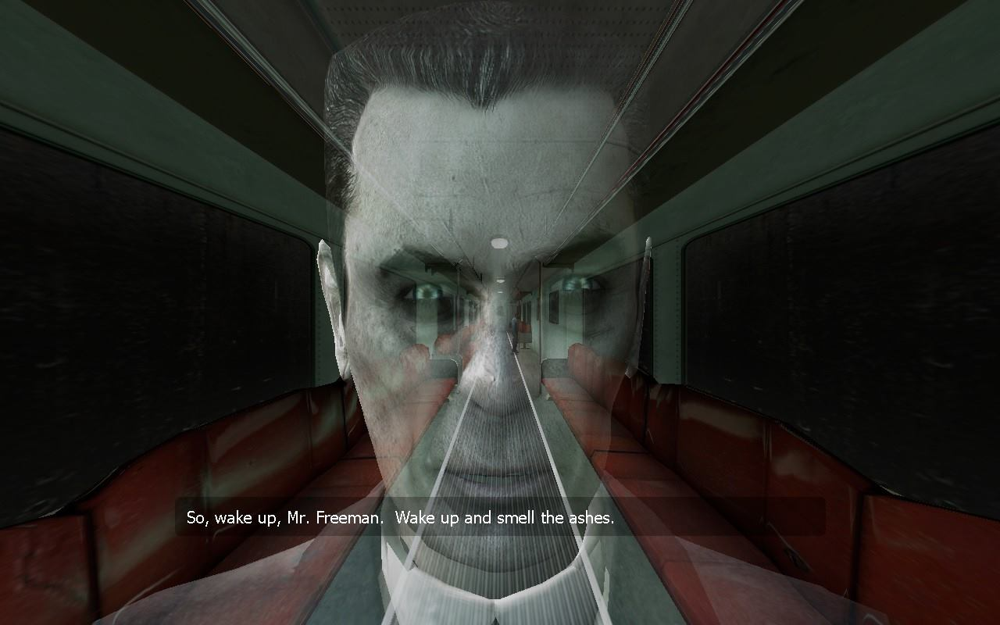

+++
title = "Dr. Freeman and his friends"
description = "Half-Life in coop"
date = 2024-03-09
+++

My first time playing Half-Life was quite recently, in 2019, when the pandemic began. Locked up at home, I thought I would start catching up on some gaming classics that I've never played. I started with the Half-Life series and immediately fell in love! The atmosphere, the soundtracks, the sounds and the whole aesthetics of this series are something truly unique. Add to that an interesting story and immersive, innovative gameplay and you get games that, many many years after release, surprises and are incredibly enjoyable.

Well, ok, although there are some people who don't like them (lol, weirdos), everyone know why they are iconic. But perhaps not everyone knows that each one of them can be played in coop. Of course, there is no official support for this mode in any of them, but what are mods for? Yes, to satisfy our needs. And I didn't know that I had a need to play Half-Life in coop until I found the mods below while googling for games to play with my homies. Thank you PC modding community.

| Game | Mod | Installation (client) |
| ---- | --- | --------------------- |
| [Black Mesa][black-mesa] | [SourceCoop][sourcecoop] | Only needs to be installed on the server
| Half-Life 1 | [Sven Co-op][sven-coop] | Available on Steam as a separate game |
| Half-Life 2 | [Synergy][synergy] | Available on Steam as a separate game |

☝️ *Coop mods list* ☝️

Of the three, I enjoyed playing Black Mesa with SourceCoop mod the most. The fact that the original Half-Life got such a good remake is already cool af (thanks [Crowbar Collective][crowbar-collective], you guys are crazy), even more so playing it with friends. I especially recommend it due to the fact that Sven Co-op has a lot of bugs and weird glitches that sometimes do not allow you to move on to the next location, or they are just annoying. It may be more convenient to simply play `BM + SourceCoop` instead of `HL1 + Sven Co-op`, unless you care very much about the original experience.

Yeah, but after all, playing any of these mods is fun, even better than classic singleplayer experience. The combination of FPS with physics engine-based puzzles and a narrative without cutscenes works very well in cooperative mode. These are some of the better coop campaigns I've ever played, no kidding. Nothing more satisfaying than fighting Xen aliens, smashing boxes and moving barrels all over the map with your gf, bf, fwb or anyone... Just not to be lonely... 🤔 If you haven't tried it yet, get your buddies together and do it.

### But how? 🛠️

You will most likely be forced to host your own server, as there are not many (if any) public ones to play on. As for Synergy and Sven Co-op, it's rather simple, just create server from main game menu and invite your friends. By doing so, you will create a server that runs only when your game is running. In my case it worked fine in Synergy, but in Sven Co-op the server crashed every few minutes. Things can also go wrong with the SourceCoop server setup, as it is more complicated and runs as a separate application, you can see the guide for it [here][sourcecoop-docs]. 

Due to the problems I mentioned and the and the fact that I wanted to simplify deployment of these servers a bit, I decided that I would create [Docker][docker] images for them. I only skipped Synergy because hosting a server from within the game works well and is easy to use. With Docker solution, all you need to do is run a container with selected image according to the instructions in the repo and you're done. Each container is configurable through environment variables, so you can easily choose the parameters of the game, the map, the number of players and so on. They work as dedicated servers, running independently of your game so you can run them on any machine and leave them running for as long as you want. Don't be afraid if you haven't used Docker before, just [RTFM][docker-docs].

Repositories: 
- [HL1 Sven Co-op dedicated server in Docker][svencoop-docker-image]
- [BM SourceCoop dedicated server in Docker][sourcecoop-docker-image]

No matter how you run the server of a particular mod, remember to [forward the ports on your router][port-forwarding], otherwise no one will be able to access it. If you have any problems with the setup, feel free to contact me. 🤙🤙

Till next time!

[sven-coop]: https://store.steampowered.com/app/225840/Sven_Coop/
[synergy]: https://store.steampowered.com/app/17520/Synergy/
[black-mesa]: https://store.steampowered.com/app/362890/Black_Mesa/
[crowbar-collective]: https://www.crowbarcollective.com/
[sourcecoop]: https://github.com/ampreeT/SourceCoop
[sourcecoop-docs]: https://steamcommunity.com/sharedfiles/filedetails/?id=2200247356
[docker]: https://docs.docker.com/get-started/overview/
[docker-docs]: https://docs.docker.com/manuals/
[sourcecoop-docker-image]: https://git.vercetti.cc/mr-vercetti/docker-blackmesa-coop-server
[svencoop-docker-image]: https://git.vercetti.cc/mr-vercetti/docker-svencoop-server
[port-forwarding]: https://www.noip.com/support/knowledgebase/general-port-forwarding-guide