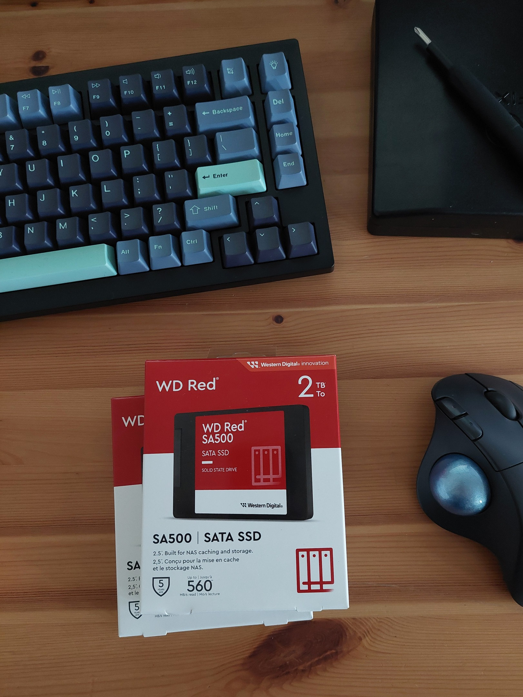
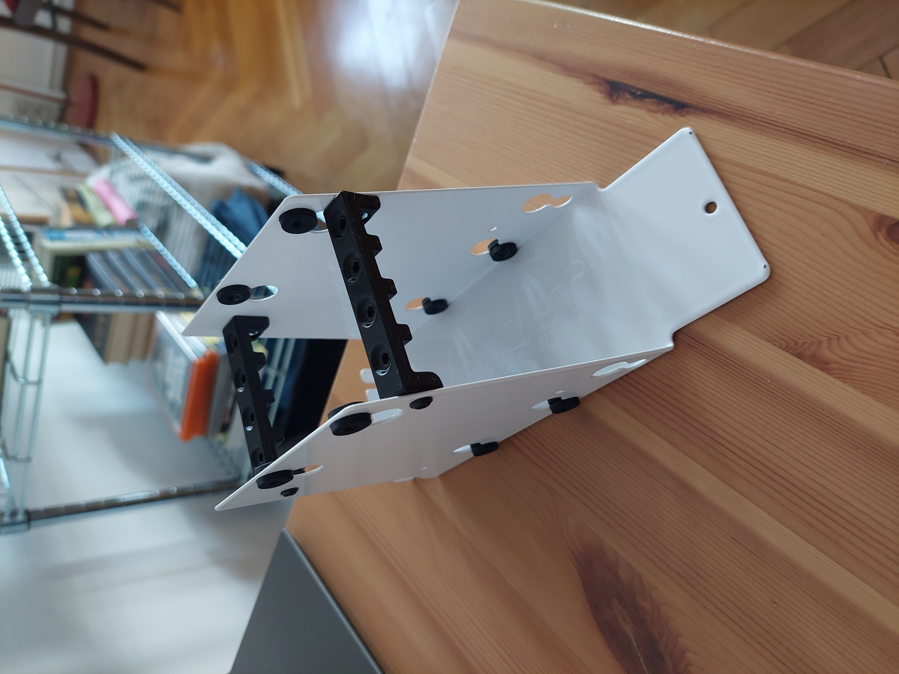
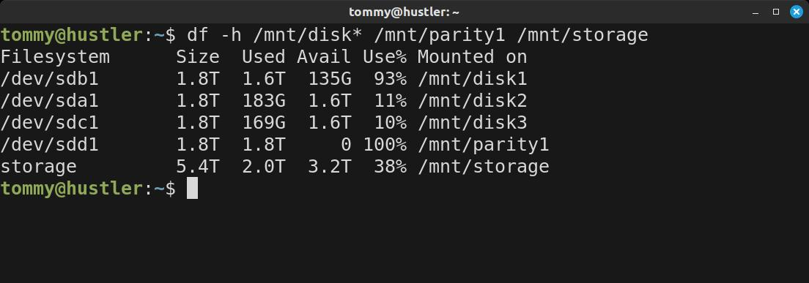

+++
title = "How much storage is enough?"
description = "Home server storage upgrade"
date = 2025-03-12
+++

Until now I only had 2TB of storage on my home server. That's not much, but it was enough to start with and it taught me to be picky about my data, which is a handy skill. Ofc, initially I planned to have more disk space, but I faced two problems - hard drives were too noisy for a machine that sits in my living room, and I was on a tight budget. I chose silence and limited space - SSD drives (1x 2TB for storage, 1x 2TB for parity). I tried my best, but after a while they filled up, mainly because more friends and family started using my media library that I share with them through Jellyfin. You know how it is. Everyone wants to have their favorite movie, and you are trying to be a good admin.

Because of this growing demand, I recently decided to do an upgrade. I went with 2x [2TB WD RED SA500][wd-red-ssd] because of their good price and high TBW. I also asked my friend who has a 3D printer to print me this [SSD caddy mod][ssd-caddy-mod] for my server case. Thanks bro.

This way, in a drive cage that normally fits two HDD drives, I could fit all four of my SSDs. It saved a lot of space, so there is still plenty for future expansion. Very clever and elegant solution.

Three of the drives are combined into one storage space using [MergerFS][mergerfs], and the fourth one is a [SnapRAID][snapraid] parity drive. This gives me around 6TB of usable space. I hope this will be enough for some time...

[wd-red-ssd]: https://shop.sandisk.com/products/ssd/internal-ssd/wd-red-sata-2-5-ssd?sku=WDS200T2R0A-68CKB0
[ssd-caddy-mod]: https://www.printables.com/model/342894-node-304-ssd-caddy
[mergerfs]: https://github.com/trapexit/mergerfs
[snapraid]: https://www.snapraid.it/
