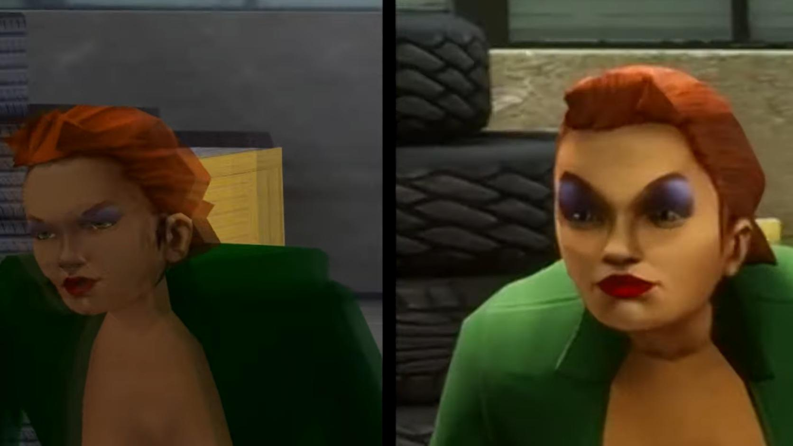
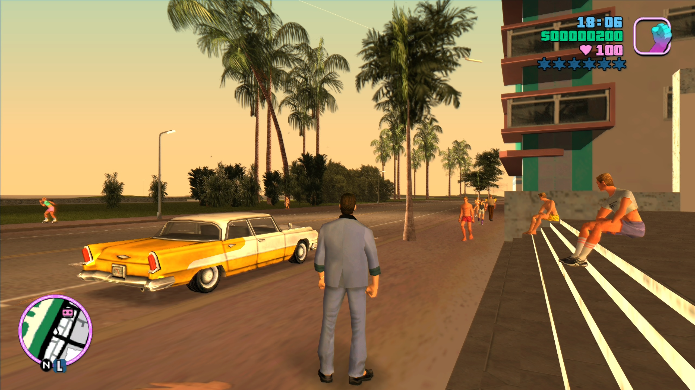

+++
title = "Look how they massacred my boy..."
description = "Modpack for original GTA Trilogy."
date = 2022-12-19
+++

I have no idea why, but last year the Rockstar team, decided to play a hilarious joke on us and massacre the 3 iconic GTAs as hard as they could. They messed up the color palette, changed the characters faces to look like they were from The Simpsons, barely fixed any bugs, make the jokes more polite, and released this as a Definitive Edition for only (sic!) $59.99. What do you guys think? Funny? 💀

Maybe a little bit. Also because the 3D Universe GTAs modding community is still alive (or was recently hehe, because [Rockstar doesn't seem to like it][re3-revc-taken-down]) and over the years has released many patches/fixes/mods that make it possible to play these amazing games without problems on new hardware and operating systems. You can just install a few of them and you have your own, better remaster. Eeeeeee... unless you are a console gamer, then you're at the mercy of Rockstar.

And yeah, I know that original trilogy had cartoonish graphics and didn't try to look super realistic, but it was all created with style that gave these games a unique vibe and didn't look like Fortnite. No offence, I also play it sometimes xD. I'm just a bit sad that it's so easy for game companies like Rockstar to destroy classics and lie to us that it's cool only to make some money.

### My go-to mods for original trilogy

So, as I am a PC player who does not like to spend money on crap, and I often like to return to the original GTA trilogy, I have created a list of mods that I consider worthy of attention. This small modpack will allow you to feel the classic atmosphere again, but in better quality, and without bugs. All for free, thanks to the super cool modding community.

Installation process is quite simple and only requires placing the files in proper directories, everything is described in ReadMe files. Just keep in mind that some of these work best on 1.0 game version. So if you have a higher one you will probably have to downgrade it. To find out how to do it visit each game's page on [PCGamingWiki]. It is also important to lock the in-game FPS to a maximum of 60, this can be done with [LimitAdjuster][limitadjuster] (one of the mods) or a external program like [RTSS][rtss]. Otherwise, you can spot many bugs.

Enjoy!

| Mod      | Description |
| ----------- | ----------------------------------------------- |
| [SilentPatch][silentpatch] | Unofficial patch, fixes many bugs |
| [WidescreenFix][widescreenfix] | Adds possibility to use widescreen resolutions |
| [LimitAdjuster][limitadjuster] | Adds posibility to tweak in-game limits (e.g., number of pedestrians, FPS) |
| [SkyGFX][skygfx] | Brings accurate PS2 and Xbox graphics to the PC version |
| [Project2DFX][project2dfx] | Visual stuff, increases object draw distances, adds LOD corona effects |
| [GInput][ginput] | Adds full controller support |

[re3-revc-taken-down]: https://www.ign.com/articles/reverse-engineered-gta-3-and-vice-city-fan-project-taken-down
[silentpatch]: https://cookieplmonster.github.io/mods/gta/
[widescreenfix]: https://thirteenag.github.io/wfp
[limitadjuster]: https://github.com/ThirteenAG/III.VC.SA.LimitAdjuster
[skygfx]: https://github.com/aap/skygfx
[ginput]: https://cookieplmonster.github.io/mods/gta/
[project2dfx]: https://thirteenag.github.io/p2dfx 
[pcgamingwiki]: https://www.pcgamingwiki.com/wiki/Home 
[rtss]: https://www.guru3d.com/files-details/rtss-rivatuner-statistics-server-download.html