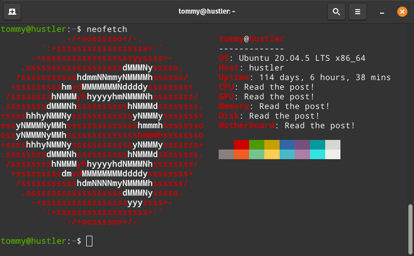

+++
title = "My home server hardware"
description = "Tough decisions about home server hardware."
date = 2023-01-26
+++

As I don't like to pay big tech companies for services that are stealing my data, some time ago I decided to change something in my life and set up a home server. I mainly wanted to create a solution to sync files from many devices, organize my movie collection as well as having my own instance of some password manager. I knew what software I need, but I wasn't sure about the hardware. And that's how I started spending more and more time on the [r/selfhosted][selfhosted] and [r/HomeServer][homeserver] subreddits. 

Oh man 💀, it was long hours of reading and making difficult decisions, after all, I did not have an infinite amount of money, but I also wanted it to be equipment that would last me a good couple of years and which will be easy upgradable. It was also important to me that the server be quiet, and small so it wouldn't draw attention in a home environment.

End of the day, I did it! I put together a server that has been running smoothly for a year now and runs services I need in about 30 [docker containers][docker-containers]. If you are interested in what services I selfhost and what software I use to manage the server, you can read about it [here][homeserver-repo].

Ok, but what about my hardware choices? Let's get down to it.

### 🔥 CPU
[Ryzen 3 2200G][cpu] 

Since I didn't want to buy a separate graphics card, it had to be a processor with an integrated GPU which will handle video transcoding with Jellyfin. The whole server was to use the Proxmox platform, (I ended up with Ubuntu on bare-metal) so I wanted it to have at least 4 cores.

### 💨 CPU cooler
The only right choice, dead silent and beautiful [Noctua NH-L9a][cpu-cooler].

### ⚙️ Motherboard
Average and budget friendly [AsRock A320M-ITX][mobo].

### 📝 RAM
[Patriot Viper DDR4, 16 GB, 3200MHz, CL16][ram]

Many people on Reddit say that the only option for server usage is RAM with ECC (Error Correction Code), to maximally protect the server from data loss. However, I did not opt for such because of the price and the fact that the likelihood of an accident in which data will be corrupted by a RAM error is very low, and I keep several backups offsite anyway.

### 💾 OS drive
Fast M.2 SSD with good price to value ratio - [Kingston A2000 250 GB][os-drive].

### 💿💿 Storage drives
2x [Sandisk Ultra 3D 2TB SSD][storage-drives]

Well... I planned to use HDD drives, but found they were too noisy for the server which is located in my living room where I spend a lot of time, so I had to get SSDs. Note that the best option for server are SSDs with PLP (Power Loss Protection) but they are more expensive. 🤨

### 🔌 PSU
Reliable beast with passive mode - [Seasonic FOCUS GX-550][psu].

### 📦 Case
Good looking, small and very popular among selfhosted community - [Fractal Design Node 304][case] (6x 3.5"/2.5" disk bays).

### 🔋 UPS
Inexpensive but sufficient [CyberPower UT850EG-FR][ups]. In my case it's used only to shut down the server gracefully in the event of a power outage.

[selfhosted]: https://www.reddit.com/r/selfhosted/
[homeserver]: https://www.reddit.com/r/HomeServer/
[docker-containers]: https://www.docker.com/resources/what-container/
[homeserver-repo]: https://git.vercetti.cc/mr-vercetti/homeserver
[cpu]: https://www.amd.com/en/products/apu/amd-ryzen-3-2200g
[cpu-cooler]: https://noctua.at/en/nh-l9a-am4
[mobo]: https://www.asrock.com/mb/AMD/A320M-ITX/index.asp
[ram]: https://viper.patriotmemory.com/products/viper-4-blackout-ddr4-performance-memory-ram-viper-gaming-by-patriot-memory
[os-drive]: https://www.kingston.com/en/support/technical/products/sa2000
[storage-drives]: https://www.westerndigital.com/en-us/products/internal-drives/sandisk-ultra-3d-sata-iii-ssd#SDSSDH3-2T00-G25
[psu]: https://seasonic.com/focus-gx
[case]: https://www.fractal-design.com/products/cases/node/node-304/black/
[ups]: https://www.cyberpower.com/eu/en/product/sku/ut850eg-fr